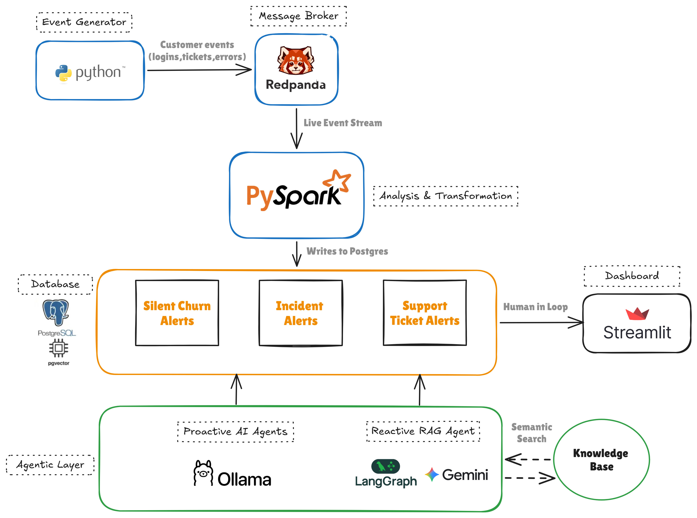
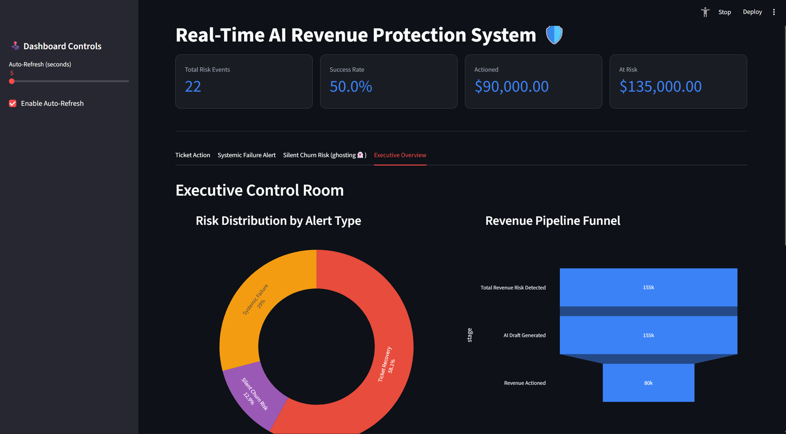

# Real-Time AI Revenue Protection System

> Detects customer friction signals from a live data stream and triggers RAG-powered AI interventions to protect high-value MRR before churn occurs.

<!-- Architecture diagram here -->

<i>Real-Time AI Agentic Revenue Recovery Engine - System Architecture</i>

---

## The Origin

This project started as a streaming data analytics pipeline  Redpanda, PySpark, hot and cold storage, the standard modern data stack. Halfway through designing the hot path, something became clear: the real-time customer event stream wasn't just data to be analyzed. It was a signal. A live feed of frustration, disengagement, and silent failure happening right now, while high-value accounts were still reachable.

That realization changed everything. The analytics project became an AI engineering project. The pipeline became an intervention system. What started as a data engineering exercise evolved into something at the intersection of streaming infrastructure, vector databases, and agentic AI  a combination that didn't exist in the original plan but made complete sense once the data was flowing.

---

## The Business Problem

In B2B SaaS, customer churn is rarely sudden. It's a slow decay. A $25,000 MRR account doesn't cancel overnight  they raise a ticket, get a generic response, hit the same error again, stop using the product, and quietly start evaluating competitors. By the time the quarterly churn report surfaces the loss, the decision was made weeks ago.

**The question this system answers:** What if you could detect the moment a high-value account starts showing friction signals, and have a personalized, expert-guided response ready before they even finish writing the ticket?

That's not a reporting problem. That's a real-time intervention problem.

### Why Real-Time Matters

A $25,000 MRR account hits a Salesforce integration failure at 2 PM. Their team spends two hours troubleshooting. By 4 PM, someone opens a ticket. By 5 PM, they're asking internally if they should look at alternatives.

A batch system catches this at midnight. A streaming system catches it at 2:01 PM.

The window between frustration and decision is narrow  often hours, sometimes minutes. Sentinel-Flow is built for that window.

---

## What It Does

Sentinel-Flow watches every customer interaction as it happens. When it detects that a high-value account is struggling  a support ticket, a repeated error pattern, or silent disengagement  it automatically drafts a personalized recovery response and surfaces it for human review. A manager reads the AI draft alongside the original complaint, refines it if needed, and authorizes it with one click.

Three situations the system handles:

**Ticket Recovery**  A high-value account raises a support ticket. The system retrieves the exact internal policy for that issue type and drafts an expert email queued for approval.

**Systemic Failure Alert**  The same account hits the same error category multiple times in a short window. Before they escalate, the system detects the pattern and drafts an executive-level intervention.

**Silent Churn Risk**  An account keeps logging in but never uses any core features. They're looking for a reason to stay but not finding one. The system notices and drafts a re-engagement outreach before anyone else does.

---

## The Innovation: Streaming + RAG

Most AI customer success tools are reactive  a customer writes in, the AI responds. They sit on top of a static inbox and process one ticket at a time.

Sentinel-Flow processes a continuous stream of behavioral events  logins, feature accesses, support tickets  and applies stateful windowed analysis across that stream in real time. The AI doesn't wait for a complaint. It watches the stream and intervenes when patterns cross thresholds.

The RAG layer adds expert grounding. Instead of generating a generic apology, the system retrieves the specific internal Standard Operating Procedure for that issue type and builds the response around it. A Salesforce failure generates a response with the exact OAuth re-authentication steps. An API latency complaint references the v2.1 endpoint and exponential backoff guidance. The AI knows what to say because it looked it up first.

This combination  streaming pattern detection feeding a RAG-powered agent  is what makes the system feel like a product rather than a demo.

---

## Architecture

<!-- Architecture diagram here -->

Three layers flowing left to right:

**Ingestion**  A synthetic event generator streams realistic B2B SaaS customer events into Redpanda, a Kafka-compatible message broker, at irregular intervals simulating real-world traffic including burst scenarios.

**Processing**  Apache Spark Structured Streaming consumes the event stream and routes it into three branches simultaneously, each applying different logic before writing to dedicated Postgres tables.

**Intelligence**  Two AI agents poll those tables and generate response drafts. A LangGraph RAG agent handles ticket recovery. An Ollama-based agent handles proactive scenarios. A Streamlit dashboard surfaces all drafts for human review and approval.

---

## Data Engineering

### Redpanda

Redpanda serves as the message broker, decoupling event production from processing. Using Redpanda over Kafka reduces operational overhead while maintaining full API compatibility  no Zookeeper, lighter resource footprint, faster local startup.

### PySpark  Three-Branch Streaming

The core data engineering challenge was implementing three fundamentally different processing patterns in a single streaming job simultaneously:

**Branch 1  Point-in-Time Filter:** Simple stateless filtering. High-value accounts with low CSAT and a support ticket event type are written directly to `high_priority_alerts`. The `event_type` filter is critical  without it, behavioral events from the proactive triggers leak into the reactive pipeline.

**Branch 2  Windowed Aggregation:** Stateful streaming using a 2-minute sliding window. Events grouped by account and category are counted. Windows where the same account hits the same error category three or more times indicate a friction loop.

**Branch 3  Behavioral Pattern Detection:** Stateful streaming comparing login events vs feature access events per account within the same window. Accounts with high logins and zero feature usage are flagged as disengagement risks.

### The Windowing Tradeoff

Sliding windows produce overlapping results  the same account appears in consecutive windows. When Spark writes both to Postgres, a composite primary key rejects the duplicate insert and crashes the streaming job. The primary key constraints were dropped on the proactive tables and deduplication moved to the dashboard layer as a pragmatic tradeoff. The architecturally cleaner fix  switching to tumbling (non-overlapping) windows  eliminates this entirely and is the production recommendation.

---

## AI Engineering

### Why Two Different AI Tools

**Gemini `gemini-embedding-001`** handles vector embeddings. Embedding quality matters here  the semantic search needs to correctly match "Salesforce integration not working" to the Data Operations SOP rather than the Technical Infrastructure one. Gemini's 768-dimension Matryoshka embeddings provide the precision needed.

**Ollama llama3 (local)** handles all text generation. The original design used Gemini for drafting, but free tier rate limits made the pipeline unreliable. Switching the drafter to a local model eliminated rate limits entirely, improved response time, and means the system runs without internet except for the embedding step.

### LangGraph RAG Agent

The reactive agent uses a three-node state machine: Retrieve → Strategize → Draft.

**Retrieve** embeds the complaint using Gemini and queries the `knowledge_base` table in Postgres using pgvector's cosine distance operator, returning the single closest SOP. If no match exists, it falls back to general best practices  the system never crashes on an empty retrieval.

**Strategize** applies deterministic business rules based on MRR tier. This node contains no AI  it's deliberately kept separate from the LLM to maintain predictability and control over the response strategy.

**Draft** sends the complaint, retrieved SOP, and strategy context to Ollama with strict prompt constraints  100 words maximum, no placeholders, no internal tier labels, specific sign-off. Preamble stripping handles Ollama's tendency to add "Here is the email:" before the actual content.

Separating concerns into distinct nodes means each stage is independently inspectable and replaceable. The Strategist can be updated with new business rules without touching retrieval or generation.

### pgvector  Vector Search in Postgres

Rather than adding a dedicated vector database, pgvector extends the existing Postgres instance to support vector operations. One database handles both relational data and semantic search  no additional service, no additional API key, no external latency.

The `<=>` operator computes cosine distance between the 768-dimension query vector and every stored SOP. The entire retrieval happens in a single SQL query.

### Proactive Agents  Prompt-Based Storytelling

The proactive agents don't use RAG intentionally. Friction loops and silent churn are behavioral patterns  there's no specific technical complaint to look up. The AI constructs a human-sounding narrative from behavioral data instead.

The Friction Loop agent adopts a Senior Customer Success Manager persona  accountable, urgent. It acknowledges repeated failures, states a personal escalation to engineering, and offers a dedicated call.

The Silent Churn agent adopts a Product Adoption Specialist persona  warm, observational, never pushy. It opens with an observation rather than a sales pitch and offers a 15-minute onboarding call to help them find value.

---

## Analytics Layer

PySpark computes a `priority_score` for every event before the AI layer sees it: `mrr × (5 − csat_score)`. This is a rudimentary Customer Health Score  the same concept used by enterprise CS platforms like Gainsight and Vitally. A $25,000 account with CSAT 1 scores 100,000. A $10,000 account with CSAT 3 scores 20,000. The dashboard surfaces highest-scoring accounts first, ensuring human attention goes where the financial impact is greatest.

The Executive Overview visualizes the pipeline as a revenue funnel  Total Risk Detected → AI Draft Generated → Revenue Actioned. The gap between stages is the operational urgency indicator. "Revenue Actioned" is used deliberately rather than "Revenue Recovered"  you can prove a human responded, you cannot prove the customer stayed without longitudinal cohort data.

---

## Dashboard Example

<i>Streamlit Dashboard: Human-in-the-Loop Control Room for Revenue Recovery</i>

---

## Tech Stack

| Layer | Technology | Role |
|---|---|---|
| Message Broker | Redpanda | Kafka-compatible streaming |
| Stream Processing | Apache Spark Structured Streaming | Three-branch windowed processing |
| Vector Database | PostgreSQL + pgvector | Relational + semantic search |
| AI Orchestration | LangGraph | Three-node RAG agent state machine |
| Embeddings | Gemini `gemini-embedding-001` | 768-dim Matryoshka vectors |
| Text Generation | Ollama llama3 (local) | Draft generation, no rate limits |
| Dashboard | Streamlit | Human-in-the-loop control room |
| Infrastructure | Docker + Docker Compose | Full local containerization |

---

## Key Design Decisions

**Why pgvector over Pinecone?** One database for both relational operations and vector search. No additional service, no additional API key, no external latency.

**Why Gemini for embeddings but Ollama for generation?** Embedding precision matters for retrieval correctness. Generation quality from llama3 is sufficient for this use case, and running it locally eliminates rate limits and API costs entirely.

**Why LangGraph over a simple LLM call?** Separation of concerns. The Strategist node contains zero AI  deterministic business rules should never be left to a language model.

**Why human-in-the-loop?** A $25,000 MRR account receiving an AI-generated email without review is a liability, not a feature. The cost of a bad AI response to an enterprise client outweighs the time saved by skipping approval.

**Why "Actioned" not "Recovered"?** You can prove a human responded. You cannot prove the customer stayed.

---

## How to Run

Requires Docker Desktop, Python 3.12+, Ollama with llama3 pulled, and a Google API key for Gemini embeddings. Full setup instructions and recovery runbook in the project documentation.

---

*Built at the intersection of real-time data engineering and agentic AI  started as a streaming analytics pipeline, evolved into a revenue protection system.*
